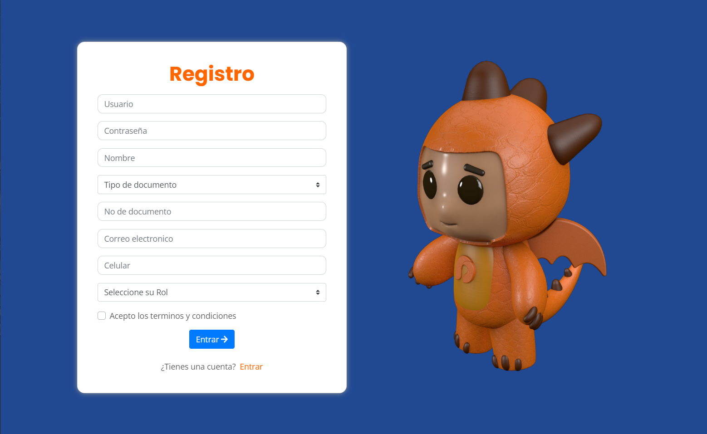
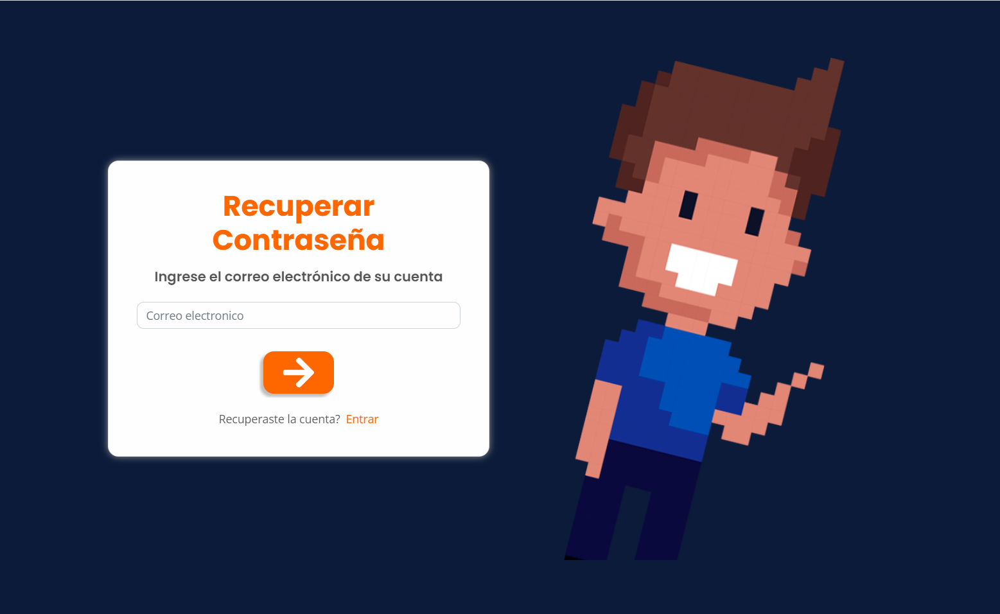
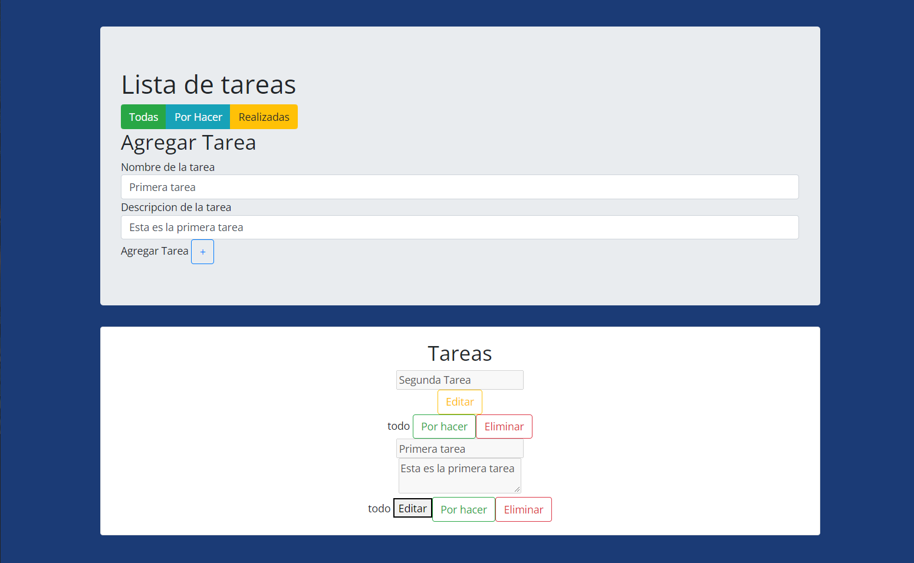

<h1 align="center">Prueba practica</h1>
<p align="center">Login con vue.js</p>

<h2>Pantalla de inicio: </h2>


<h2>Pantalla de registro: </h2>


<h2>Pantalla de recuperar contraseña:</h2>


<h2>Pantalla de tareas:</h2>


## Project setup
```
npm install
```

### Compiles and hot-reloads for development
```
npm run serve
```

### Compiles and minifies for production
```
npm run build
```

### Lints and fixes files
```
npm run lint
```

### Customize configuration
See [Configuration Reference](https://cli.vuejs.org/config/).
